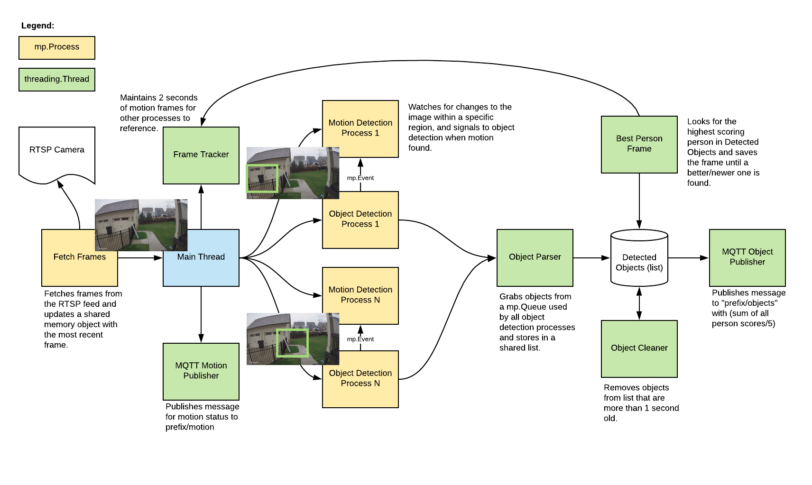
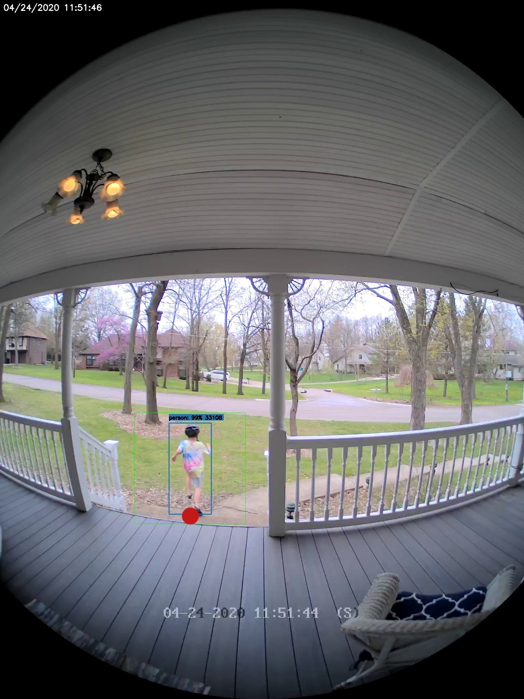
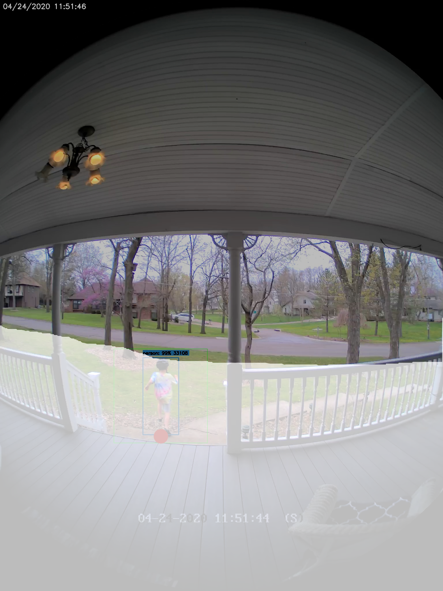

# Frigate - Realtime Object Detection for IP Cameras
Uses OpenCV and Tensorflow to perform realtime object detection locally for IP cameras. Designed for integration with HomeAssistant or others via MQTT.

Use of a [Google Coral USB Accelerator](https://coral.withgoogle.com/products/accelerator/) is optional, but highly recommended. On my Intel i7 processor, I can process 2-3 FPS with the CPU. The Coral can process 100+ FPS with very low CPU load.

- Leverages multiprocessing heavily with an emphasis on realtime over processing every frame
- Uses a very low overhead motion detection to determine where to run object detection
- Object detection with Tensorflow runs in a separate process
- Object info is published over MQTT for integration into HomeAssistant as a binary sensor
- An endpoint is available to view an MJPEG stream for debugging, but should not be used continuously



## Example video (from older version)
You see multiple bounding boxes because it draws bounding boxes from all frames in the past 1 second where a person was detected. Not all of the bounding boxes were from the current frame.
[](http://www.youtube.com/watch?v=nqHbCtyo4dY "Frigate")

## Getting Started
Run the container with
```bash
docker run --rm \
-name frigate \
--privileged \
--shm-size=512m \ # should work for a 2-3 cameras
-v /dev/bus/usb:/dev/bus/usb \
-v <path_to_config_dir>:/config:ro \
-v /etc/localtime:/etc/localtime:ro \
-p 5000:5000 \
-e FRIGATE_RTSP_PASSWORD='password' \
blakeblackshear/frigate:stable
```

Example docker-compose:
```yaml
  frigate:
    container_name: frigate
    restart: unless-stopped
    privileged: true
    shm_size: '1g' # should work for 5-7 cameras
    image: blakeblackshear/frigate:stable
    volumes:
      - /dev/bus/usb:/dev/bus/usb
      - /etc/localtime:/etc/localtime:ro
      - <path_to_config>:/config
    ports:
      - "5000:5000"
    environment:
      FRIGATE_RTSP_PASSWORD: "password"
```

A `config.yml` file must exist in the `config` directory. See example [here](config/config.example.yml) and device specific info can be found [here](docs/DEVICES.md).

## Recommended Hardware
|Name|Inference Speed|Notes|
|----|---------------|-----|
|Atomic Pi|16ms|Best option for a dedicated low power board with a small number of cameras.|
|Intel NUC NUC7i3BNK|8-10ms|Best possible performance. Can handle 7+ cameras at 5fps depending on typical amounts of motion.|
|BMAX B2 Plus|10-12ms|Good balance of performance and cost. Also capable of running many other services at the same time as frigate.

ARM boards are not officially supported at the moment due to some python dependencies that require modification to work on ARM devices. The Raspberry Pi4 gets about 16ms inference speeds, but the hardware acceleration for ffmpeg does not work for converting yuv420 to rgb24. The Atomic Pi is x86 and much more efficient.

Users have reported varying success in getting frigate to run in a VM. In some cases, the virtualization layer introduces a significant delay in communication with the Coral. If running virtualized in Proxmox, pass the USB card/interface to the virtual machine not the USB ID for faster inference speed.

## Integration with HomeAssistant

Setup a the camera, binary_sensor, sensor and optionally automation as shown for each camera you define in frigate. Replace <camera_name> with the camera name as defined in the frigate `config.yml` (The `frigate_coral_fps` and `frigate_coral_inference` sensors only need to be defined once)

```
camera:
  - name: <camera_name> Last Person
    platform: mqtt
    topic: frigate/<camera_name>/person/snapshot
  - name: <camera_name> Last Car
    platform: mqtt
    topic: frigate/<camera_name>/car/snapshot

binary_sensor:
  - name: <camera_name> Person
    platform: mqtt
    state_topic: "frigate/<camera_name>/person"
    device_class: motion
    availability_topic: "frigate/available"

sensor:
  - platform: rest
    name: Frigate Debug
    resource: http://localhost:5000/debug/stats
    scan_interval: 5
    json_attributes:
      - <camera_name>
      - coral
    value_template: 'OK'  
  - platform: template
    sensors:
      <camera_name>_fps: 
        value_template: '{{ states.sensor.frigate_debug.attributes["<camera_name>"]["fps"] }}'
        unit_of_measurement: 'FPS'
      <camera_name>_skipped_fps: 
        value_template: '{{ states.sensor.frigate_debug.attributes["<camera_name>"]["skipped_fps"] }}'
        unit_of_measurement: 'FPS'
      <camera_name>_detection_fps: 
        value_template: '{{ states.sensor.frigate_debug.attributes["<camera_name>"]["detection_fps"] }}'
        unit_of_measurement: 'FPS'
      frigate_coral_fps: 
        value_template: '{{ states.sensor.frigate_debug.attributes["coral"]["fps"] }}'
        unit_of_measurement: 'FPS'
      frigate_coral_inference:
        value_template: '{{ states.sensor.frigate_debug.attributes["coral"]["inference_speed"] }}' 
        unit_of_measurement: 'ms'
        
automation:
  - alias: Alert me if a person is detected while armed away
    trigger: 
      platform: state
      entity_id: binary_sensor.camera_person
      from: 'off'
      to: 'on'
    condition:
      - condition: state
        entity_id: alarm_control_panel.home_alarm
        state: armed_away
    action:
      - service: notify.user_telegram
        data:
          message: "A person was detected."
          data:
            photo:
              - url: http://<ip>:5000/<camera_name>/person/best.jpg
                caption: A person was detected.        
```
## Debugging Endpoint

Keep in mind the MJPEG endpoint is for debugging only, but should not be used continuously as it will put additional load on the system. 

Access the mjpeg stream at `http://localhost:5000/<camera_name>` and the best snapshot for any object type with at `http://localhost:5000/<camera_name>/<object_name>/best.jpg`

You can access a higher resolution mjpeg stream by appending `h=height-in-pixels` to the endpoint. For example `http://localhost:5000/back?h=1080`. You can also increase the FPS by appending `fps=frame-rate` to the URL such as `http://localhost:5000/back?fps=10` or both with `?fps=10&h=1000`

Debug info is available at `http://localhost:5000/debug/stats`


## Using a custom model
Models for both CPU and EdgeTPU (Coral) are bundled in the image. You can use your own models with volume mounts:
- CPU Model: `/cpu_model.tflite`
- EdgeTPU Model: `/edgetpu_model.tflite`
- Labels: `/labelmap.txt`

## Masks and limiting detection to a certain area
You can create a *bitmap (bmp)* file the same aspect ratio as your camera feed to limit detection to certain areas. The mask works by looking at the bottom center of any bounding box (first image, red dot below) and comparing that to your mask. If that red dot falls on an area of your mask that is black, the detection (and motion) will be ignored. The mask in the second image would limit detection on this camera to only objects that are in the front yard and not the street. 

<a href="docs/example-mask-check-point.png"></a>
<a href="docs/example-mask.bmp"></a>
<a href="docs/example-mask-overlay.png"></a>

## Tips
- Lower the framerate of the video feed on the camera to reduce the CPU usage for capturing the feed. Not as effective, but you can also modify the `take_frame` [configuration](config/config.example.yml) for each camera to only analyze every other frame, or every third frame, etc. 
- Hard code the resolution of each camera in your config if you are having difficulty starting frigate or if the initial ffprobe for camerea resolution fails or returns incorrect info. Example:
```
cameras:
  back:
    ffmpeg:
      input: rtsp://<camera>
    height: 1080
    width: 1920
```
- Additional logging is available in the docker container - You can view the logs by running `docker logs -t frigate`
- Object configuration - Tracked objects types, sizes and thresholds can be defined globally and/or on a per camera basis. The global and camera object configuration is *merged*. For example, if you defined tracking person, car, and truck globally but modified your backyard camera to only track person, the global config would merge making the effective list for the backyard camera still contain person, car and truck. If you want precise object tracking per camera, best practice to put a minimal list of objects at the global level and expand objects on a per camera basis. Object threshold and area configuration will be used first from the camera object config (if defined) and then from the global config.  See the [example config](config/config.example.yml) for more information. 

