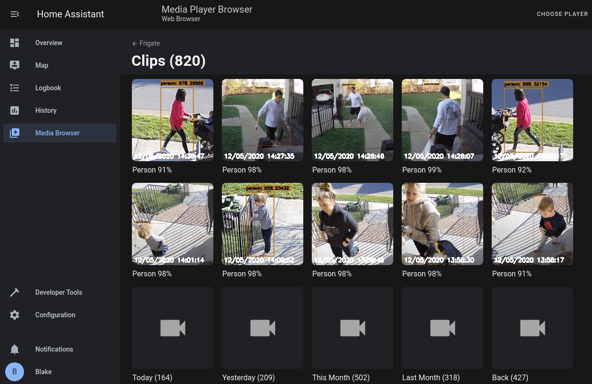
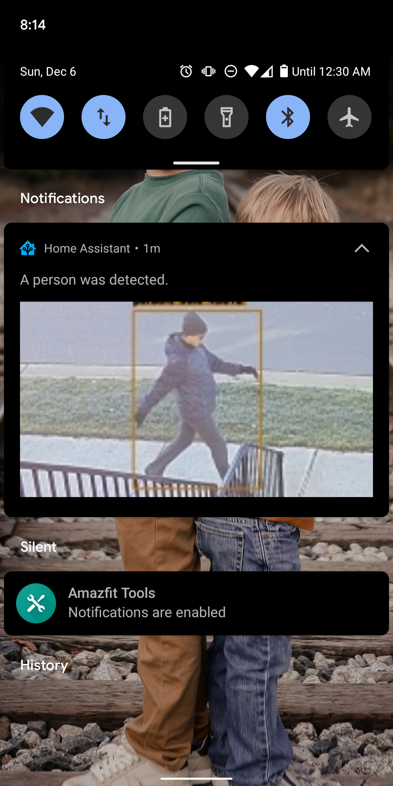
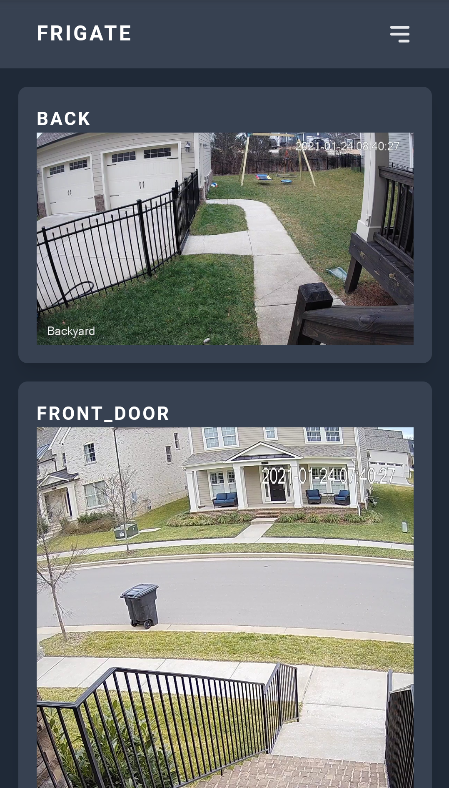
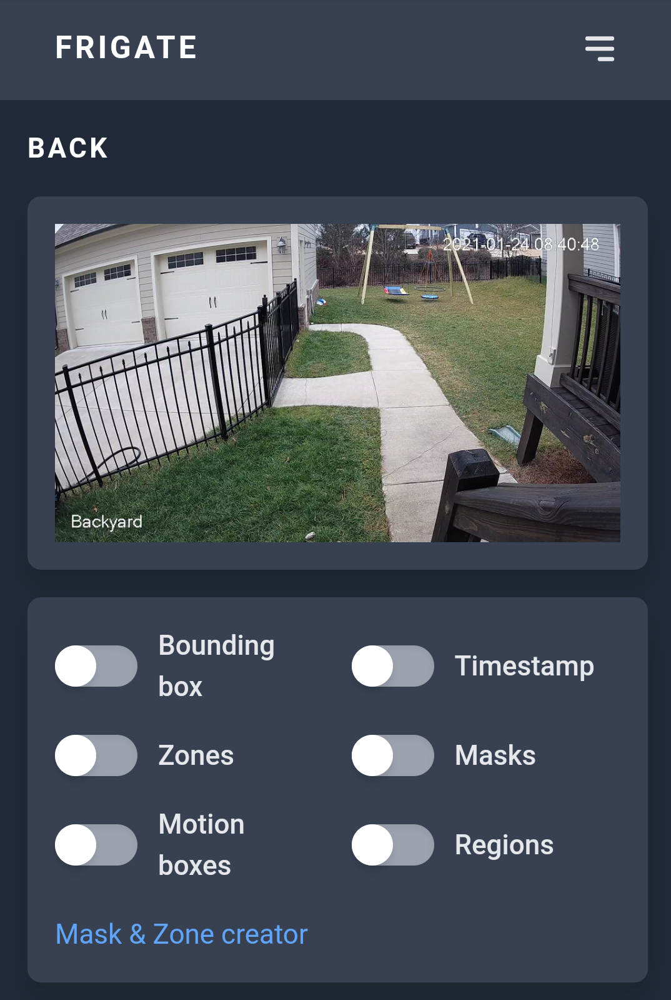

  

# Frigate - NVR With Realtime Object Detection for IP Cameras

A complete and local NVR designed for [Home Assistant](https://www.home-assistant.io) with AI object detection. Uses OpenCV and Tensorflow to perform realtime object detection locally for IP cameras.

Use of a [Google Coral Accelerator](https://coral.ai/products/) is optional, but highly recommended. The Coral will outperform even the best CPUs and can process 100+ FPS with very little overhead.

- Tight integration with Home Assistant via a [custom component](https://github.com/blakeblackshear/frigate-hass-integration)
- Designed to minimize resource use and maximize performance by only looking for objects when and where it is necessary
- Leverages multiprocessing heavily with an emphasis on realtime over processing every frame
- Uses a very low overhead motion detection to determine where to run object detection
- Object detection with TensorFlow runs in separate processes for maximum FPS
- Communicates over MQTT for easy integration into other systems
- Records video with retention settings based on detected objects
- 24/7 recording
- Re-streaming via RTSP to reduce the number of connections to your camera
- WebRTC & MSE support for low-latency live view

## Documentation

View the documentation at https://docs.frigate.video

## Donations

If you would like to make a donation to support development, please use [Github Sponsors](https://github.com/sponsors/blakeblackshear).

## Screenshots

Integration into Home Assistant

Also comes with a builtin UI:

