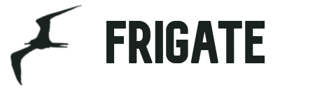

  

# Frigate NVR™ - Realtime Object Detection for IP Cameras

\[English\] | [简体中文](https://github.com/blakeblackshear/frigate/blob/dev/README_CN.md)

---

  

  <b><a href="https://www.atlascloud.ai/?utm_source=github&utm_medium=link&utm_campaign=frigate">Atlas Cloud</a></b> is an OpenAI-compatible inference platform that can power Frigate's
  <a href="https://docs.frigate.video/configuration/genai/">Generative AI</a> features as a drop-in multimodal LLM backend.
  Point the <code>atlas</code> provider at Atlas Cloud and use a vision-capable model
  (such as <code>qwen/qwen3-vl-235b-a22b-thinking</code> or <code>Qwen/Qwen3-VL-235B-A22B-Instruct</code>)
  to generate natural-language object and review descriptions from detection frames —
  no local GPU required. See the <a href="https://docs.frigate.video/configuration/genai/">GenAI configuration docs</a>
  to get started, or grab a <a href="https://www.atlascloud.ai/console/coding-plan">coding plan</a>.

Vision-capable Atlas Cloud models for GenAI descriptions

Frigate's GenAI features require a **vision-capable** model. Good multimodal choices on Atlas Cloud include:

- `qwen/qwen3-vl-235b-a22b-thinking`
- `Qwen/Qwen3-VL-235B-A22B-Instruct`
- `qwen/qwen3-vl-30b-a3b-instruct`
- `qwen/qwen3-vl-30b-a3b-thinking`
- `qwen/qwen3-vl-8b-instruct`
- `google/gemini-3.5-flash`
- `google/gemini-3.1-pro-preview`

The full, always-current model catalog is available at the
[Atlas Cloud console](https://www.atlascloud.ai/console).

---

A complete and local NVR designed for [Home Assistant](https://www.home-assistant.io) with AI object detection. Uses OpenCV and Tensorflow to perform realtime object detection locally for IP cameras.

Use of a GPU or AI accelerator is highly recommended. AI accelerators will outperform even the best CPUs with very little overhead. See Frigate's supported [object detectors](https://docs.frigate.video/configuration/object_detectors/).

- Tight integration with Home Assistant via a [custom component](https://github.com/blakeblackshear/frigate-hass-integration)
- Designed to minimize resource use and maximize performance by only looking for objects when and where it is necessary
- Leverages multiprocessing heavily with an emphasis on realtime over processing every frame
- Uses a very low overhead motion detection to determine where to run object detection
- Object detection with TensorFlow runs in separate processes for maximum FPS
- Communicates over MQTT for easy integration into other systems
- Records video with retention settings based on detected objects
- 24/7 recording
- Re-streaming via RTSP to reduce the number of connections to your camera
- WebRTC & MSE support for low-latency live view

## Documentation

View the documentation at https://docs.frigate.video

## Donations

If you would like to make a donation to support development, please use [Github Sponsors](https://github.com/sponsors/blakeblackshear).

## License

This project is licensed under the **MIT License**.

- **Code:** The source code, configuration files, and documentation in this repository are available under the [MIT License](LICENSE). You are free to use, modify, and distribute the code as long as you include the original copyright notice.
- **Trademarks:** The "Frigate" name, the "Frigate NVR" brand, and the Frigate logo are **trademarks of Frigate, Inc.** and are **not** covered by the MIT License.

Please see our [Trademark Policy](TRADEMARK.md) for details on acceptable use of our brand assets.

## Screenshots

### Live dashboard

### Streamlined review workflow

### Multi-camera scrubbing

### Built-in mask and zone editor

## Translations

We use [Weblate](https://hosted.weblate.org/projects/frigate-nvr/) to support language translations. Contributions are always welcome.

---

**Copyright © 2026 Frigate, Inc.**
