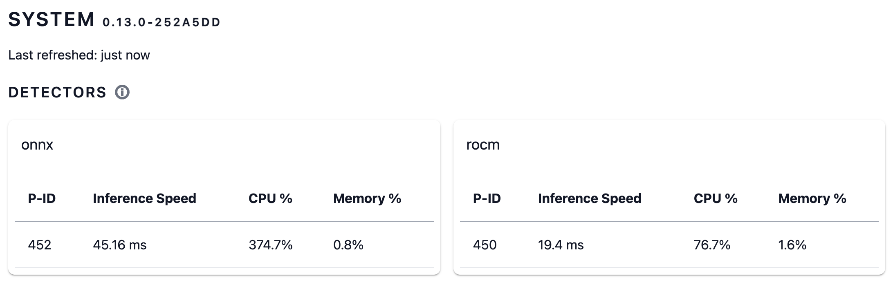

# AMD/ROCm GPU based detector

## Building

Running `make local-rocm` results in following images:

- `frigate:latest-rocm`, 7.64 GB, all possible chipsets
- `frigate:latest-rocm-gfx1030`, 3.72 GB, gfx1030 and compatible
- `frigate:latest-rocm-gfx900`, 3.64 GB, gfx900 and compatible

## Docker settings

AMD/ROCm needs access to `/dev/kfd` and `/dev/dri`. When running as user also needs the `video` group. Sometimes also needs the `render` and `ssh/_ssh` groups.
For reference/comparison see [running ROCm PyTorch Docker image](https://rocm.docs.amd.com/projects/install-on-linux/en/develop/how-to/3rd-party/pytorch-install.html#using-docker-with-pytorch-pre-installed).

```bash
$ docker run --device=/dev/kfd --device=/dev/dri --group-add video \
    ...
```

When running on iGPU you likely need to specify the proper `HSA_OVERRIDE_GFX_VERSION` environment variable. For chip specific docker images this is done automatically, for others you need to figure out what it is. AMD/ROCm does not officially support the iGPUs. See the [ROCm issue](https://github.com/ROCm/ROCm/issues/1743) for context and examples.

If you have `gfx90c` (can be queried with `/opt/rocm/bin/rocminfo`) then you need to run with the gfx900 driver, so you would modify the docker launch by something like this:

```bash
$ docker run ... -e HSA_OVERRIDE_GFX_VERSION=9.0.0 ...
```

## Frigate configuration

An example of a working configuration:

```yaml
model:
  path: /yolov8s_320x320.onnx
  labelmap_path: /yolov8s_labels.txt
  model_type: yolov8
detectors:
  rocm:
    type: rocm
```

Note that the detector will first compile the onnx model into AMD/ROCm format and that can take a minute. The compiled file is cached under the configuration directory in the model cache so will not be done the next startup. When you change the hardware/platform you need to delete the file so it can be redone.

## Other models and running the yolov8 models on CPU

The build is bundling the following [ultralytics](https://github.com/ultralytics/ultralytics) pretrained models into the Docker image:

- `/yolov8n_320x320.onnx`, labels: `/yolov8n_labels.txt` or `/yolov8n_labels-frigate.txt`
- `/yolov8s_320x320.onnx`, labels: `/yolov8s_labels.txt` or `/yolov8s_labels-frigate.txt`
- `/yolov8m_320x320.onnx`, labels: `/yolov8m_labels.txt` or `/yolov8m_labels-frigate.txt`
- `/yolov8n-oiv7_320x320.onnx`, labels: `/yolov8n-oiv7_labels.txt` or `/yolov8n-oiv7_labels-frigate.txt`
- `/yolov8s-oiv7_320x320.onnx`, labels: `/yolov8s-oiv7_labels.txt` or `/yolov8s-oiv7_labels-frigate.txt`

The `*-frigate.txt` labels are grouped to a few relevant categories one would likely want. The Open Images V7 trained models (`*-oiv7_*`) have over 600 labels so it's easier to use the grouped versions than configuring everything by hand in frigate. The following unique labels are in there: person, car, motorcycle, other_vehicle, cat, dog, animal, bird, other.

I have also implemented a CPU detector based on the ONNX engine. So you can run the models without the GPU, just change the `detector.rocm.type` into `onnx`.

The models are added into the docker images automatically, they are taken from my [models](https://github.com/harakas/models/tree/main/ultralytics/yolov8.1) repository.

## Performance

On an AMD Ryzen 3 5400U with Radeon Graphics ([ASRock 4X4 BOX-5400U](https://www.asrockind.com/en-gb/4X4%20BOX-5400U)) I'm getting about 140fps detections with yolov8n and 65fps with yolov8s.

I was getting a lot of false positives with the Google Coral based edge tpu default model rendering frigate almost useless (unless very draconian constraints were put into place). Not so with the ultralytics' yolov8s. It seems to be excellent for this job even if it is only pretrained on the coco dataset.


