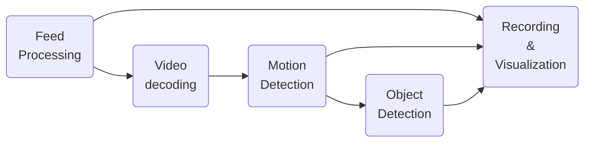
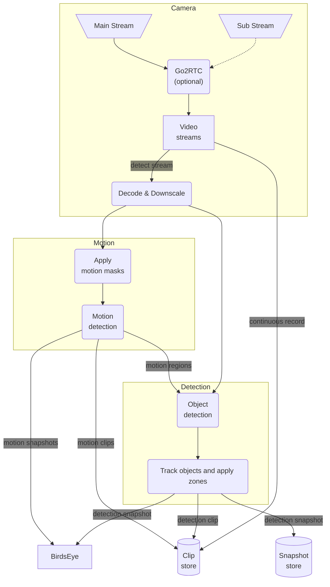

Frigate uses a sophisticated video pipeline that starts with the camera feeds and progressively applies transformations to them (e.g. decoding, motion detection, etc.).

This guide provides an overview to help users put the key Frigate concepts on a map.

### High level view of the video pipeline

### Detailed view of the video pipeline

