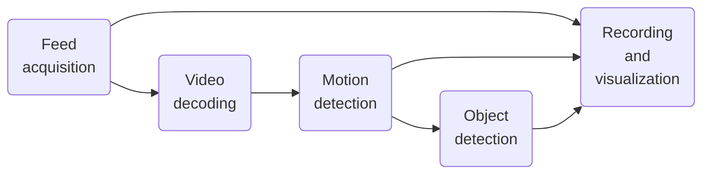
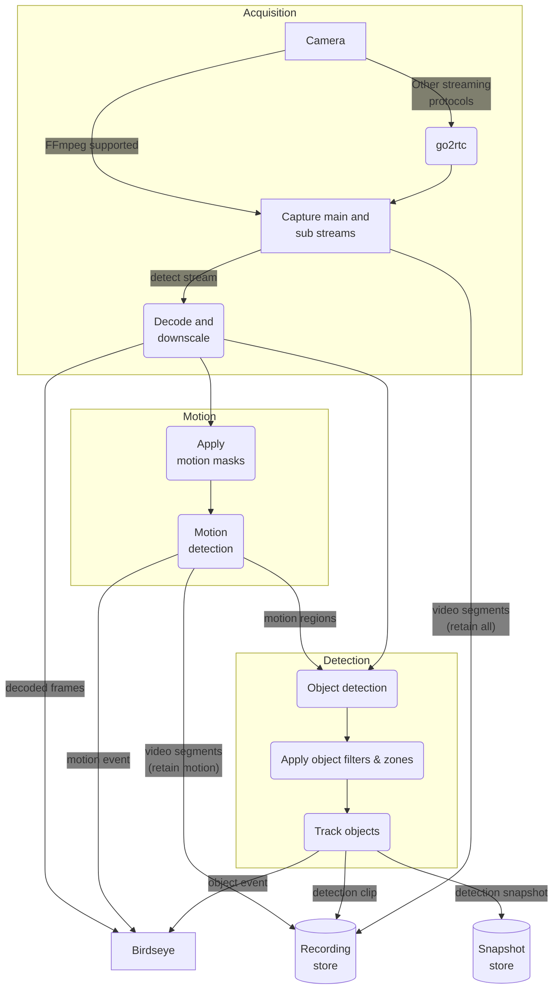

Frigate uses a sophisticated video pipeline that starts with the camera feed and progressively applies transformations to it (e.g. decoding, motion detection, etc.).

This guide provides an overview to help users understand some of the key Frigate concepts.

## Overview

At a high level, there are five processing steps that could be applied to a camera feed 

As the diagram shows, all feeds first need to be acquired. Depending on the data source, it may be as simple as using FFmpeg to connect to an RTSP source via TCP or something more involved like connecting to an Apple Homekit camera using go2rtc. A single camera can produce a main (i.e. high resolution) and a sub (i.e. lower resolution) video feed. 

Typically, the sub-feed will be decoded to produce full-frame images. As part of this process, the resolution may be downscaled and an image sampling frequency may be imposed (e.g. keep 5 frames per second). 

These frames will then be compared over time to detect movement areas (a.k.a. motion boxes). These motion boxes are combined into motion regions and are analyzed by a machine learning model to detect known objects. Finally, the snapshot and recording retention config will decide what video clips and events should be saved.

## Detailed view of the video pipeline

The following diagram adds a lot more detail than the simple view explained before. The goal is to show the detailed data paths between the processing steps.

