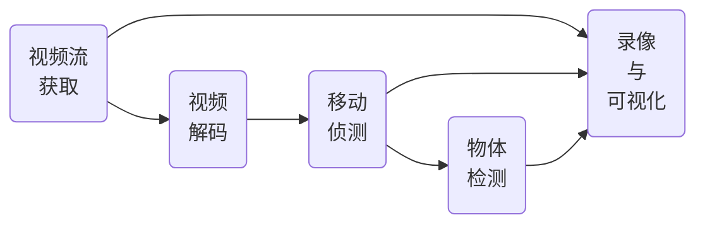
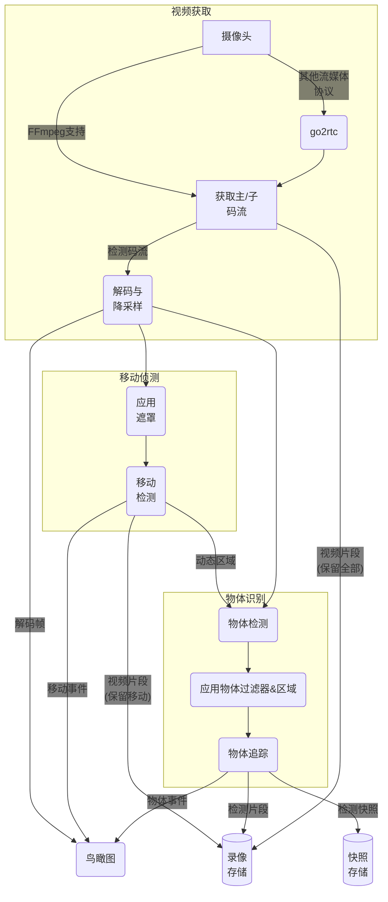

:::tip
由于本文涉及过多专业领域内容，对普通用户帮助不算特别多，将不会进行精翻；本文使用DeepSeek AI进行翻译，仅做参考。
:::

Frigate采用先进的视频处理流程，从摄像头获取视频流开始，逐步应用多种处理流程（如解码、移动侦测等）。

本指南概述了Frigate的核心概念，帮助用户理解其工作原理。

## 概览

高层级来看，摄像头视频流会经历五个处理步骤：

如图所示，所有视频流首先需要被获取。根据数据源不同，可能简单如通过FFmpeg连接RTSP源，也可能复杂如通过go2rtc连接Apple Homekit摄像头。单个摄像头可生成主码流（高清）和子码流（低清）。

通常子码流会被解码生成全帧图像。此过程可能包含分辨率降采样和帧率控制（如保持5帧/秒）。

这些帧将通过时序比对来检测移动区域（即动态框）。动态框会组合成动态区域，并由机器学习模型分析识别已知物体。最终根据快照和录像保留策略决定保存哪些视频片段和事件。

## 视频流程详述
下图展示了比前文更详细的数据流转路径：

