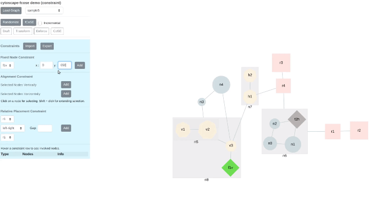

cytoscape-fcose
================================================================================


## Description


fCoSE (pron. "f-cosay", **f**ast **Co**mpound **S**pring **E**mbedder), is a faster version of our earlier compound spring embedder algorithm named [CoSE](https://github.com/cytoscape/cytoscape.js-cose-bilkent), implemented as a Cytoscape.js extension by [i-Vis Lab](http://cs.bilkent.edu.tr/~ivis/) in Bilkent University.

Here are some demos: **simple**, **compound**, and **constraints**, respectively:
<p align="center">
<a href="https://ivis-at-bilkent.github.io/cytoscape.js-fcose/demo/demo.html" title="Simple"></a> &emsp;
<a href="https://ivis-at-bilkent.github.io/cytoscape.js-fcose/demo/demo-compound.html" title="Compound"></a> &emsp;
<a href="https://ivis-at-bilkent.github.io/cytoscape.js-fcose/demo/demo-constraint.html" title="Constraints"></a>
</p>

fCoSE layout algorithm combines the speed of spectral layout with the aesthetics of force-directed layout. fCoSE runs up to 2 times as fast as CoSE while achieving similar aesthetics.

<p align="center"></p>

Furthermore, fCoSE also supports a fairly rich set of constraint types (i.e., fixed position, vertical/horizontal alignment and relative placement).

<p align="center"></p>

You can see constraint support in action in the following videos: [fixed node](https://youtu.be/vRZVlwntzGY), [alignment](https://youtu.be/O5rddJ7DteU), [relative placement](https://youtu.be/Xcm87bT50RA), [hybrid](https://youtu.be/KRAQHmnTvUA), [real life graphs](https://youtu.be/vTPy9G2ALcI). Constraints can also be added [incrementally](https://youtu.be/DTm2WmzwP4k) on a given layout. 

Please cite the following when you use this layout:

H. Balci and U. Dogrusoz, "[fCoSE: A Fast Compound Graph Layout Algorithm with Constraint Support](https://doi.org/10.1109/TVCG.2021.3095303)," in IEEE Transactions on Visualization and Computer Graphics, 28(12), pp. 4582-4593, 2022.

U. Dogrusoz, E. Giral, A. Cetintas, A. Civril and E. Demir, "[A Layout Algorithm For Undirected Compound Graphs](http://www.sciencedirect.com/science/article/pii/S0020025508004799)", Information Sciences, 179, pp. 980-994, 2009.

## Dependencies

 * Cytoscape.js ^3.2.0
 * cose-base ^2.0.0
 * cytoscape-layout-utilities.js (optional for packing disconnected components) ^1.0.0

## Documentation

fCoSE supports user-defined placement constraints as well as its full support for compound graphs. These constraints may be defined for simple nodes. Supported constraint types are:

* **Fixed node constraint:** The user may provide *exact* desired positions for a set of nodes called *fixed nodes*. For example, in order to position node *n1* to *(x: 100, y: 200)* and node *n2* to *(x: 200, y: -300)* as a result of the layout, ```fixedNodeConstraint``` option should be set as follows:   

  ```js
  fixedNodeConstraint: [{nodeId: 'n1', position: {x: 100, y: 200}},
    {nodeId: 'n2', position: {x: 200, y: -300}}],
  ```

* **Alignment constraint:** This constraint aims to align two or more nodes (with respect to their centers) vertically or horizontally. For example, for the vertical alignment of nodes {*n1, n2, n3*} and {*n4, n5*}, and horizontal alignment of nodes {*n2, n4*} as a result of the layout, ```alignmentConstraint``` option should be set as follows:
  ```js
  alignmentConstraint: {vertical: [['n1', 'n2', 'n3'], ['n4', 'n5']], horizontal: [['n2', 'n4']]},
  ```
&nbsp;&nbsp;&nbsp;&nbsp;&nbsp;&nbsp;***Note:** Alignment constraints in a direction must be given in most compact form. Example: ```['n1', 'n2', 'n3']``` instead of ```['n1', 'n2'], ['n1', 'n3']```.* 

* **Relative placement constraint:** The user may constrain the position of a node relative to another node in either vertical or horizontal direction. For example, in order to position node *n1* to be above of node *n2* by at least 100 pixels and position node *n3* to be on the left of node *n4* by at least 75 pixels as a result of the layout, ```relativePlacementConstraint``` option should be set as follows: 

  ```js
  relativePlacementConstraint: [{top: 'n1', bottom: 'n2', gap: 100}, 
     {left: 'n3', right: 'n4', gap: 75}],
  ```
  The `gap` property is optional. If it is omitted, average `idealEdgeLength` is used as the gap value.

## Usage instructions

Download the library:
 * via npm: `npm install cytoscape-fcose`,
 * via bower: `bower install cytoscape-fcose`, or
 * via direct download in the repository (probably from a tag).

Import the library as appropriate for your project:

ES import:

```js
import cytoscape from 'cytoscape';
import fcose from 'cytoscape-fcose';

cytoscape.use( fcose );
```

CommonJS require:

```js
let cytoscape = require('cytoscape');
let fcose = require('cytoscape-fcose');

cytoscape.use( fcose ); // register extension
```

AMD:

```js
require(['cytoscape', 'cytoscape-fcose'], function( cytoscape, fcose ){
  fcose( cytoscape ); // register extension
});
```

Plain HTML/JS has the extension registered for you automatically, because no `require()` is needed. Just add the following files:

```
<script src="https://unpkg.com/layout-base/layout-base.js"></script>
<script src="https://unpkg.com/cose-base/cose-base.js"></script>
<script src="https://unpkg.com/cytoscape-fcose/cytoscape-fcose.js"></script>
```


## API

When calling the layout, e.g. `cy.layout({ name: 'fcose', ... })`, the following options are supported:

```js
var defaultOptions = {

  // 'draft', 'default' or 'proof' 
  // - "draft" only applies spectral layout 
  // - "default" improves the quality with incremental layout (fast cooling rate)
  // - "proof" improves the quality with incremental layout (slow cooling rate) 
  quality: "default",
  // Use random node positions at beginning of layout
  // if this is set to false, then quality option must be "proof"
  randomize: true, 
  // Whether or not to animate the layout
  animate: true, 
  // Duration of animation in ms, if enabled
  animationDuration: 1000, 
  // Easing of animation, if enabled
  animationEasing: undefined, 
  // Fit the viewport to the repositioned nodes
  fit: true, 
  // Padding around layout
  padding: 30,
  // Whether to include labels in node dimensions. Valid in "proof" quality
  nodeDimensionsIncludeLabels: false,
  // Whether or not simple nodes (non-compound nodes) are of uniform dimensions
  uniformNodeDimensions: false,
  // Whether to pack disconnected components - cytoscape-layout-utilities extension should be registered and initialized
  packComponents: true,
  // Layout step - all, transformed, enforced, cose - for debug purpose only
  step: "all",
  
  /* spectral layout options */
  
  // False for random, true for greedy sampling
  samplingType: true,
  // Sample size to construct distance matrix
  sampleSize: 25,
  // Separation amount between nodes
  nodeSeparation: 75,
  // Power iteration tolerance
  piTol: 0.0000001,
  
  /* incremental layout options */
  
  // Node repulsion (non overlapping) multiplier
  nodeRepulsion: node => 4500,
  // Ideal edge (non nested) length
  idealEdgeLength: edge => 50,
  // Divisor to compute edge forces
  edgeElasticity: edge => 0.45,
  // Nesting factor (multiplier) to compute ideal edge length for nested edges
  nestingFactor: 0.1,
  // Maximum number of iterations to perform - this is a suggested value and might be adjusted by the algorithm as required
  numIter: 2500,
  // For enabling tiling
  tile: true,
  // The comparison function to be used while sorting nodes during tiling operation.
  // Takes the ids of 2 nodes that will be compared as a parameter and the default tiling operation is performed when this option is not set.
  // It works similar to ``compareFunction`` parameter of ``Array.prototype.sort()``
  // If node1 is less then node2 by some ordering criterion ``tilingCompareBy(nodeId1, nodeId2)`` must return a negative value
  // If node1 is greater then node2 by some ordering criterion ``tilingCompareBy(nodeId1, nodeId2)`` must return a positive value
  // If node1 is equal to node2 by some ordering criterion ``tilingCompareBy(nodeId1, nodeId2)`` must return 0
  tilingCompareBy: undefined, 
  // Represents the amount of the vertical space to put between the zero degree members during the tiling operation(can also be a function)
  tilingPaddingVertical: 10,
  // Represents the amount of the horizontal space to put between the zero degree members during the tiling operation(can also be a function)
  tilingPaddingHorizontal: 10,
  // Gravity force (constant)
  gravity: 0.25,
  // Gravity range (constant) for compounds
  gravityRangeCompound: 1.5,
  // Gravity force (constant) for compounds
  gravityCompound: 1.0,
  // Gravity range (constant)
  gravityRange: 3.8, 
  // Initial cooling factor for incremental layout  
  initialEnergyOnIncremental: 0.3,

  /* constraint options */

  // Fix desired nodes to predefined positions
  // [{nodeId: 'n1', position: {x: 100, y: 200}}, {...}]
  fixedNodeConstraint: undefined,
  // Align desired nodes in vertical/horizontal direction
  // {vertical: [['n1', 'n2'], [...]], horizontal: [['n2', 'n4'], [...]]}
  alignmentConstraint: undefined,
  // Place two nodes relatively in vertical/horizontal direction
  // [{top: 'n1', bottom: 'n2', gap: 100}, {left: 'n3', right: 'n4', gap: 75}, {...}]
  relativePlacementConstraint: undefined,

  /* layout event callbacks */
  ready: () => {}, // on layoutready
  stop: () => {} // on layoutstop
};
```
To be able to use `packComponents` option, `cytoscape-layout-utilities` extension should also be registered in the application.
Packing related [options](https://github.com/iVis-at-Bilkent/cytoscape.js-layout-utilities#default-options) should be set via `cytoscape-layout-utilities` extension.
If they are not set, fCoSE uses default options.


## Build targets

* `npm run test` : Run Mocha tests in `./test`
* `npm run build` : Build `./src/**` into `cytoscape-fcose.js`
* `npm run watch` : Automatically build on changes with live reloading (N.b. you must already have an HTTP server running)
* `npm run dev` : Automatically build on changes with live reloading with webpack dev server
* `npm run lint` : Run eslint on the source

N.b. all builds use babel, so modern ES features can be used in the `src`.


## Publishing instructions

This project is set up to automatically be published to npm and bower.  To publish:

1. Build the extension : `npm run build:release`
1. Commit the build : `git commit -am "Build for release"`
1. Bump the version number and tag: `npm version major|minor|patch`
1. Push to origin: `git push && git push --tags`
1. Publish to npm: `npm publish .`
1. If publishing to bower for the first time, you'll need to run `bower register cytoscape-fcose https://github.com/iVis-at-Bilkent/cytoscape.js-fcose.git`
1. [Make a new release](https://github.com/iVis-at-Bilkent/cytoscape.js-fcose/releases/new) for Zenodo.

## Team

  * [Hasan Balcı](https://github.com/hasanbalci) and [Ugur Dogrusoz](https://github.com/ugurdogrusoz) of [i-Vis at Bilkent University](http://www.cs.bilkent.edu.tr/~ivis)
